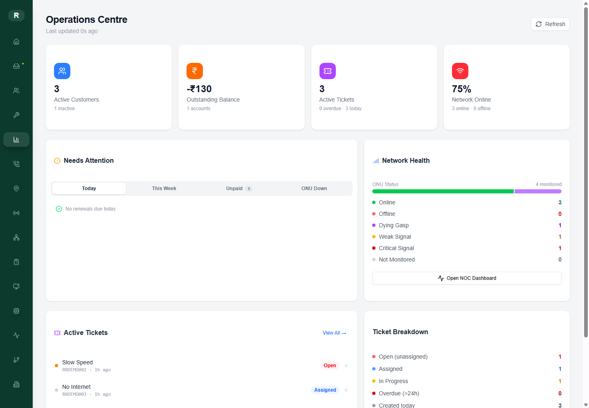
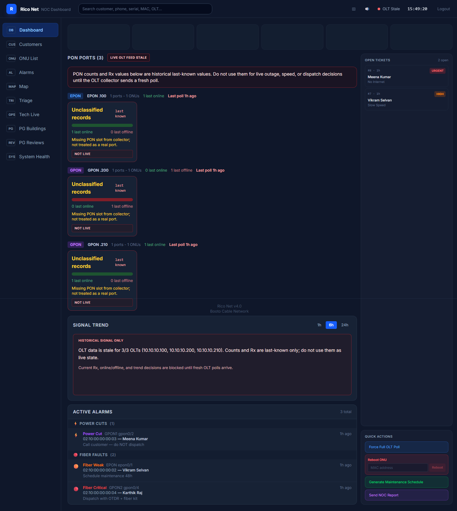

# Rico Net - ISP Intelligence Platform

Rico Net is a full-stack ISP operations platform built as a practical project for a local broadband network. It connects customer records, field technician workflows, OLT/ONU diagnostics, alarms, ticketing, and a NOC dashboard into one operating system.

This public repository is a sanitized showcase copy. It contains demo-safe code, fake sample data, and deployment notes. Real customer data, credentials, OLT dumps, private photos, and local runtime files are intentionally excluded.

## Live Public Demo

| Surface | Link |
| --- | --- |
| Admin dashboard | <https://rico-net-admin.vercel.app> |
| NOC dashboard | <https://rico-net-noc.vercel.app> |
| Backend health check | <https://rico-net-api-demo.onrender.com/healthz> |

Demo login:

```text
username: admin
password: demo1234
```

The backend runs on Render free tier, so the first request after inactivity can take 50+ seconds while the service wakes up.

## Screenshots

| Admin Operations Centre | NOC Dashboard |
| --- | --- |
|  |  |

## What This Shows

- FastAPI backend with JWT auth, service-layer architecture, SQLAlchemy models, and PostgreSQL support
- Next.js 15 admin dashboard for customers, tickets, survey, inventory, and pipeline operations
- Vite React NOC dashboard for alarms, ONUs, signal health, predictions, and network triage
- Expo React Native field technician app for mobile workflows
- Railwire scraper service design with public-safe configuration examples
- OLT proxy/collector design with hardware access disabled by default
- Demo seed data for customers, ONUs, alarms, tickets, predictions, inventory, and technicians

## Repository Map

| Folder | Purpose |
| --- | --- |
| `backend/` | FastAPI API, models, routers, services, workers, demo seed script |
| `frontend-pro/` | Admin/management web UI built with Next.js and Refine |
| `noc-dashboard/` | Real-time NOC command-room dashboard built with Vite React |
| `mobile/` | Expo technician mobile app |
| `scraper/` | Railwire scraper/dashboard code with demo-safe examples |
| `olt-proxy/` | OLT collector/proxy code, safe-mode by default |
| `docs/realignment/` | Current architecture baseline and planning docs |
| `docs/DEPLOYMENT.md` | Free hosting and demo deployment guide |

## Quick Local Demo

Prerequisites: Node.js 20+, Python 3.11+, Docker Desktop.

```bash
cp .env.example .env
docker compose up -d db
cd backend
python -m venv .venv
.venv\Scripts\activate
pip install -r requirements.txt
python scripts\seed_demo.py --create-tables
uvicorn main:app --reload
```

In another terminal:

```bash
cd frontend-pro
npm install
echo NEXT_PUBLIC_API_URL=http://127.0.0.1:8000 > .env.local
npm run dev
```

NOC dashboard:

```bash
cd noc-dashboard
npm install
echo VITE_API_URL=http://127.0.0.1:8000 > .env.local
npm run dev
```

Demo login:

```text
username: admin
password: demo1234
```

## Public Demo Data

Run this whenever you want a clean fake dataset:

```bash
cd backend
python scripts\seed_demo.py --create-tables --reset-demo
```

The seed script only creates synthetic usernames, phone numbers, addresses, MACs, ONT serials, alarms, and tickets. It does not include real subscriber details.

## Deployment Summary

- Current public admin deployment: Vercel project `rico-net-admin`.
- Current public NOC deployment: Vercel project `rico-net-noc`.
- Current public backend deployment: Render service `rico-net-api-demo`.
- Current public database: Neon Postgres free tier with synthetic seed data.
- Set `NEXT_PUBLIC_API_URL` and `VITE_API_URL` to the public backend URL.
- Keep `OLT_PROXY_ENABLED=false` for public demos.

Full steps are in [`docs/DEPLOYMENT.md`](docs/DEPLOYMENT.md).

## Safety Notes

This is a portfolio/demo repository. Hardware control is disabled by default, all credentials are placeholders, and all datasets are fake. The private production repository remains separate.
